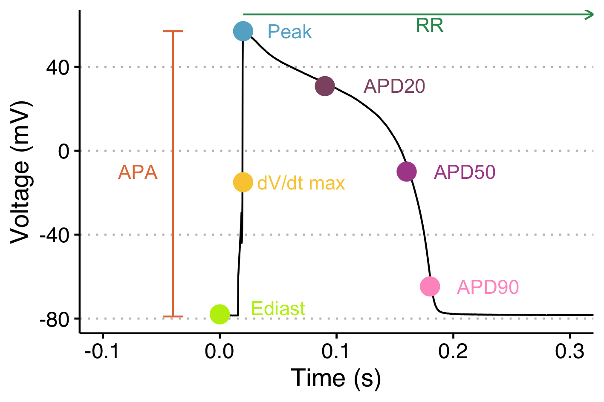
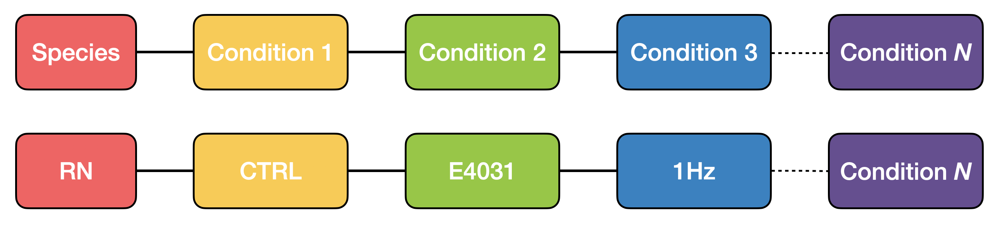
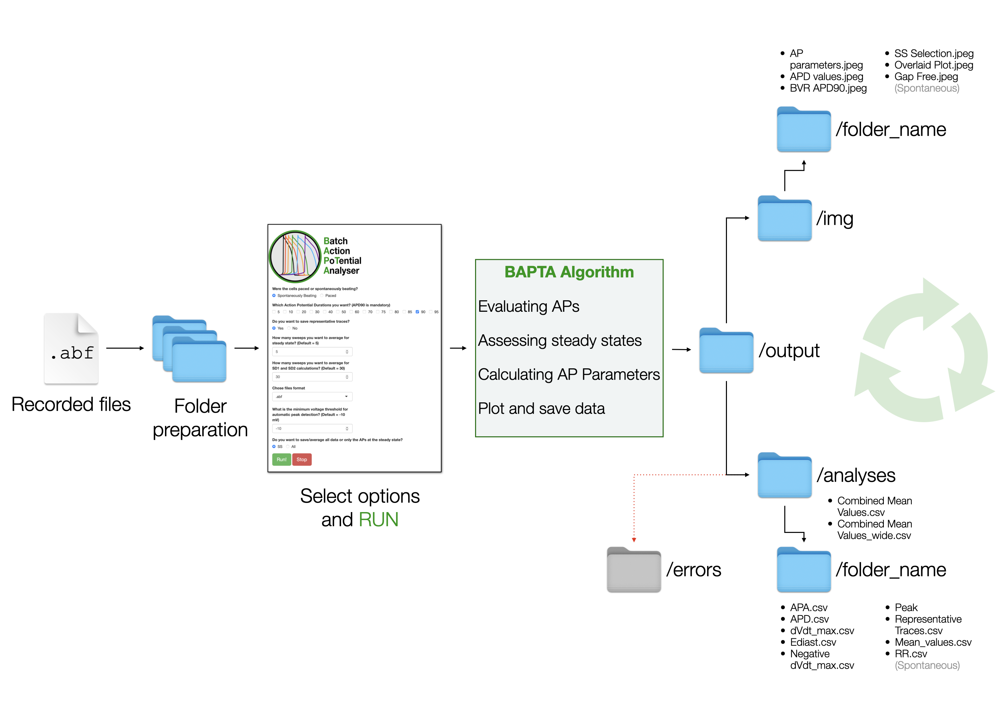
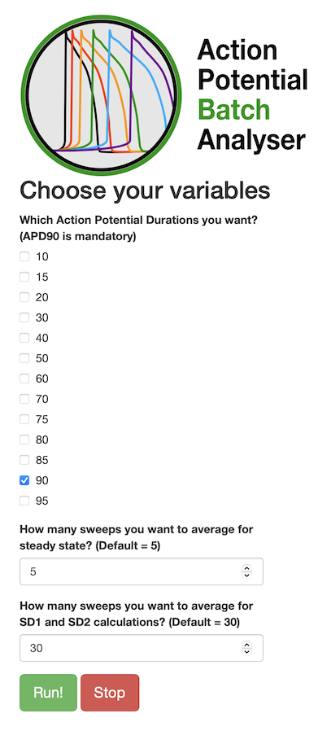
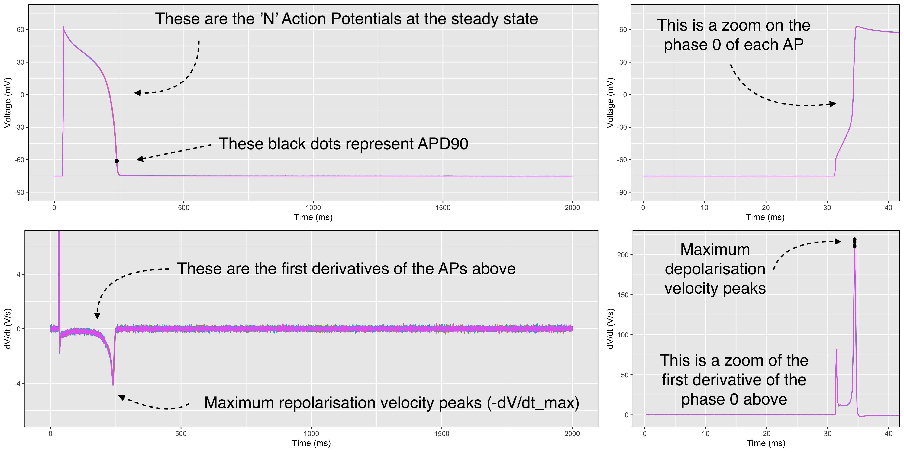
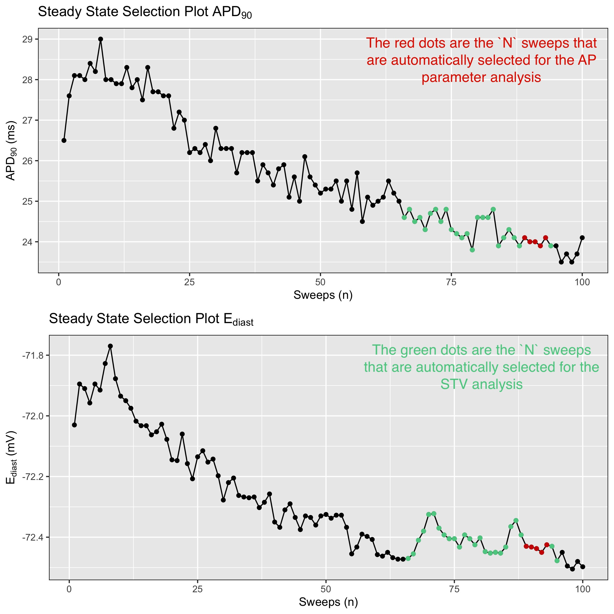
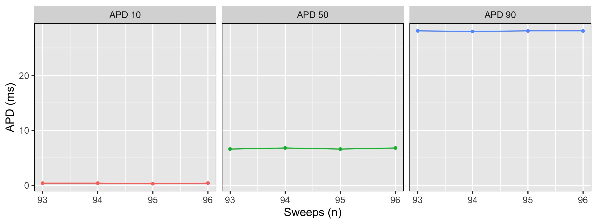
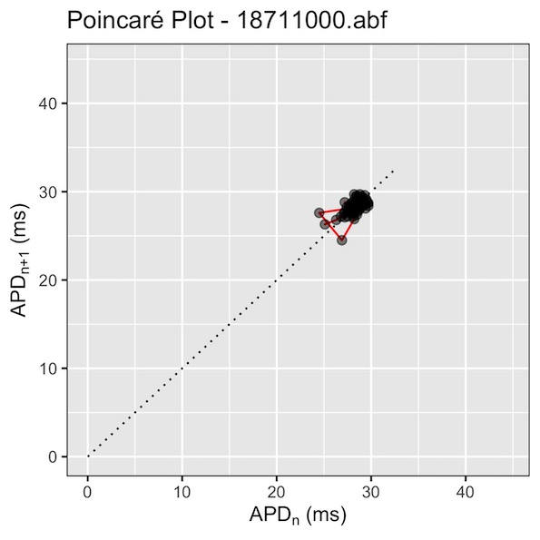

# Action Potential Batch Analyzer

This script allows the automated analysis of triggered (Paced) and spontaneous (Gap-Free) cardiac action potentials (APs) from adult, neonatal and hiPSC-derived cardiomyocytes recorded with the patch-clamp technique. We hope this open source software tool might ease your scientific life and avoid you to spend nights analyzing cardiac APs!

**Important:** Current version of BAPTA works natively with Axon Binary Files (**.abf**). Compatibility with other systems is implemented via **.csv** or **.txt** formats. This software tool is and will remain open source - GPL v3.0 license.

### Knowledge of the parameters

This software will extract parameters listed in the table below. It important to understand these parameters, so we provide brief description in the table:

| Parameter                         | Abbreviation | Measure unit | Description                                                                                          
|-----------------------------------|--------------|--------------|-----------------------------------------------------------------------------------------------------|
| Action Potential (AP) Duration    | APD          | ms           | AP durations (APD) from peak to 10%-90% (step 10%) of the repolarization phase.                     |
| Resting Membrane Potential        | Ediast       | mV           | Resting membrane potential                                                                          |
| AP Amplitude                      | APA          | mV           | The span of the AP from the baseline to the peak                                                    |
| AP Peak                           | Peak         | mV           | The max upstroke peak value reached by the AP                                                       |
| Maximum upstroke velocity         | dV/dt_max    | V/s          | The maximum upstroke velocity of the depolarization phase of the AP                                 |
| Maximum decay velocity            | -dV/dt_max   | V/s          | The maximum velocity reached in the repolarization phase of the AP                                  |
| RR Intervals / Cycle length. **Only for spontaneous AP**      | RR           | ms           | Time between two peaks of consequent APs                                |
| Frequency.  **Only for spontaneous AP**                       | Freq         | Hz           | 1 s. / mean(RR s.) Mean frequensy of APs                                |
| Short Term Variability of the APD | SD1          | ms           | Short Term (beat-to-beat) Variability of the APD_90 (point of 90% AP repolarization).               |
| Long Term Variability of the APD  | SD2          | ms           | Long Term Variability (longitudinal drift over time) of the APD_90 (point of 90% AP repolarization).|

## How to use

### Installation

1.  Web browser: If you do not have a web browser please download and install a modern one, [Google Chrome](https://www.google.com/chrome/) for instance. *This step is important only if you need user interface, otherwise you can work directly in the interface of R-Studio*

2.  **R:** Download and install [R](https://cloud.r-project.org/) following the instructions for your specific operating system

3.  **R-Studio:** Download and install [R-Studio](https://www.rstudio.com/products/rstudio/download/#download) following the instructions for your specific operating system

4.  **BAPTA:** You can clone the repository via [GIT](https://github.com/l-sala/BAPTA.git) or download zip archive from the same page:

    Press "Code" button -\> download ZIP -\> unzip archive to suitable directory.

### File Formats

Software support:

1.  Axon Binary Files (**.abf**) - Paced and Gap-Free mode.
2.  Coma Separated Values format (**.csv**) or (**.txt**) - Paced and Gap-Free mode.

For .txt and .csv we data should be prepared in following format:

**Gap-Fee:**

Files should contain 2 columns in following order:

1\. Time (s. or ms.); 2. Voltage (mV)

| **Time_s**  | **Trace_mV** |
|-------------|--------------|
| 0           | -73.36       |
| 2e-04       | -73.39       |
| 2e-04       | -73.46       |
| ...         | ...          |

**Paced:**

Files should contain more then 2 columns in following order:

1\. Time (s or ms); 2. Voltage 1 (mV); 3. Voltage 2 (mV); n. etc.

| **Time_s**     | **Trace_1\_mV** | **Trace_2\_mV** | **Trace_n\_mV** |
|----------------|-----------------|-----------------|-----------------|
| 0              | -73.36          | -76.53          | ...             |
| 2e-04          | -73.39          | -76.57          | ...             |
| 2e-04          | -73.46          | -76.53          | ...             |
| ...            | ...             | ...             | ...             |

### Folder Structure Preparation (super important!)

In the root directory (BAPTA folder), find or create folder named "***data***". In the ***data*** folder import folders with yours recording.

**IMPORTANT:**

-   Underscore "\_" used for separating conditions in the data name.

-   Naming of folders with files should follow template

<!-- -->

    Species_Group_Condition1_Condition2_..._Condition`N`

It is mandatory to **create one folder for each pacing frequency and/or for each condition**. For example, if you have to analyse APs from Guinea Pig (`Species`) CMs, in control and in the presence of a drug (`Group`) at two different pacing frequencies or drug concentrations (`Condition`), I recommend to create 4 folders with the following structure:

-   GP_CTR_Pacing-Frequency-1
-   GP_DRUG_Pacing-Frequency-1
-   GP_CTR_Pacing-Frequency-2
-   GP_DRUG_Pacing-Frequency-2

Another example:

-   iPSC_Vehicle
-   iPSC_Isoprenaline_1µM
-   iPSC_Isoprenaline_10µM

From now on, these folders will be generically termed as `foldername`.

**IMPORTANT:** Before start of the analysis it is strongly recommended to properly divide files in the proper folders.

-  Any alteration in the ***data*** folder is prohibited during analysis.

-  Prohibited to import both Paced and Spontaneous files at once. Analyze them separately!

## How to launch it

### macOS and Linux

-   Launch by double-clicking `AP_Batch_Analyzer.sh`. This will open a Terminal window and load the Shiny app interface.

### Windows

-   Launch by double-clicking `app.R` in the main directory. This will load the Shiny app in RStudio;
-   In the top side of the RStudio window, click ▶️`Run App`. 

### Interface

Once the app has launched, you will have access to a simplified interface with three main

choices:

1.  Select Spontaneously Beating or Paced

2.  Select the APDs for which you want quantitative data. APD90 is default and mandatory.

3.  Select whether you want to save representative traces or not.

4.  Enter the number of APs that you want to be averaged at the steady state.

    The default is 5.

5.  Enter the number of APs that you want to be used for SD1 and SD2 calculations.

    The default is 30.

6.  Chose the file format.

7.  **In case of .txt or .csv formats:** Provide information about time: seconds or milliseconds

8.  **Spontaneous Beating only:** Enter the minimum voltage threshold for automatic peak detection.

    -10 mV is the default value.

9.  **Spontaneous Beating only:** Select either you want to save results of analysis for the entire file or just at steady state.

After entering all the parameters, click **RUN** to start the analyses.

## Analyses

The tool will automatically create the analysis folders based on input folder names.

### Analysis Folder Structure

    .
    └─── output
        └─── analyses  
            └─── `foldername`
                  └─── APA
                    └─── `filename` APA.csv 
                    └─── ...  
                  └─── APD
                    └─── `filename`.csv
                    └─── ...  
                  └─── dVdt_max
                    └─── `filename` dVdt_max.csv
                    └─── ...  
                  └─── Ediast
                    └─── `filename` Ediast.csv
                    └─── ...  
                  └─── Negative_dVdt_max
                    └─── `filename` Negative dVdt_max.csv
                    └─── ...  
                  └─── Peak
                    └─── `filename` Peak.csv
                    └─── ... 
                  └─── Representative_Traces
                    └─── `filename` Representative_Traces.csv
                    └─── ...  
                  └─── RR
                    └─── `filename` RR.csv #Only for spontaneous AP
                    └─── ...  
                  └─── `foldername` Mean Values.csv
            └─── Combined Mean Values.csv
            └─── Combined Mean Values_wide.csv
                  

### Analysis Files

The tool will generate the following analysis files:

#### `foldername` Mean Values.csv

(e.g. GP_CTR_Pacing-Frequency-1 Mean Values.csv)

This file contains the mean values for all the parameters, indicated above, for each of the analysed file. Specifically for APDs: according to the number of APD values chosen at the beginning of the analysis, more columns will be added to this table. If APD_10, APD_50, APD_90 are selected at the beginning, the table will add 3 columns.

After analysis will be concluded script will create: **Combined Mean Values.csv** and **Combined Mean Values_wide.csv**. These files contain mean values across all traces in the analysis.

### Steady State identification

The tool identifies, within the time course of an AP file, the APs which have the lowest and most stable diastolic intervals. Among these, the tool generates groups of *N* (this number is customizable) subsequent APs. Among these groups, it will select the one characterised by lowest absolute APD_90 cumulative difference, and it will calculate and average all the parameters from these *N* APs. Default values for *N* are 5 for the calculation of AP parameters and 30 for STV calculations. With the exclusion of SD1 and SD2, each parameter will be calculated and described by a binary system of coordinates.

## Plots

The tool will generate the following plots:

    .
    └─── output
        └─── img  
              └─── `foldername` 
                └─── `filename` AP Parameters.jpeg
                └─── `filename` APD Values.jpeg
                └─── `filename` BVR_APD90.jpeg
                └─── `filename` SS Selection.jpeg

This plot is made by 4 panels: 1. Top left: the representative APs automatically selected by the tool. The black dots represent the APD90 of each AP. 2. Bottom left: the first derivative of the aforementioned APs, which clearly shows the max. repolarisation velocity (-dV/dt_max). 3. Top right: this panel helps the user to see whether the upstroke phase is clear or whether it has an artifact due to the stimulus pulse. 4. Bottom right: the first derivative of the zoomed-in APs. This helps the user to undestand whether the upstroke velocity (dV/dt_max) is correctly measured. Black dots indicate the dV/dt_Max points that have been used for the analyses.

This plot is very important: it shows the time course of APD90 (top) and Ediast (bottom); coloured in red are the points automatically selected for the subsequent AP analyses, while in green are indicated those selected for the STV analysis. The automatic selection is based on two parameters:

1.  The polarisation of E_diast: the tool will select the APs in the most negative quantile (default 80%). which should be as much negative as possible. This filter may not be very useful for adult CMs, bt for stem cell-derived CMs I have noticed that more reliable APD values are obtained when negative Ediasts are used.
2.  The variability of the APD90, which should be as minimum as possible for a proper steady state.

This plot may be useful to check whether all the selected AP values are at in a steady state. It may also be useful to get APD values in a glance.

This is the Poincaré plot used to calculate and visualize APD90 dispersion (SD1 and SD2) as previously done in [Altomare et al., Circulation: Arrhythmia & Electrophysiology, 2015](https://doi.org/10.1161/circep.114.002572).

## Errors

In case if script identified file that can not be analyse, it will create **error** folder. This folder will contain error.csv where you may find detailed description about inappropriate files. Also script will produce folders with pictures of these files.

    .
    └─── output
        └─── error  
              └─── `foldername` 
                └─── `filename` error.jpeg
                └─── ...
             └─── error.csv

## Limitations

1.  We have not introduced statistics in this tool as it is difficult to predict the number of groups the user would like to compare. The automated output analysis provides a complete table with all the mean data.

2.  In some rare conditions, and particularly when working with CMs that have a low upstroke velocity, stimulation artifacts might be selected by the software as dV/dt_max values, particularly when the square pulse is long (\> 3 ms) and the access resistance is quite high (\> 30 MÎhm).

3.  BAPTA cannot discriminate between normal or diseased action potentials, thus arrhythmic events

    occurring during phases 1-3 of the cardiac AP (e.g. EADs) are not currently recognised.

## Special thanks

Kudos to Stanislav Syekirin and Florian Pein for [*readABF*](https://CRAN.R-project.org/package=readABF) *package and documentation for it*. Package allows the direct import of ABFs into large data lists and help to solve an issue with extraction of stimulation duration.

------------------------------------------------------------------------

**TL;DR for electrophysiologists: this tool will allow you to get reliable and consistent analyses of triggered APs in an automated way, as long as you have recorded APs correctly ;)**
