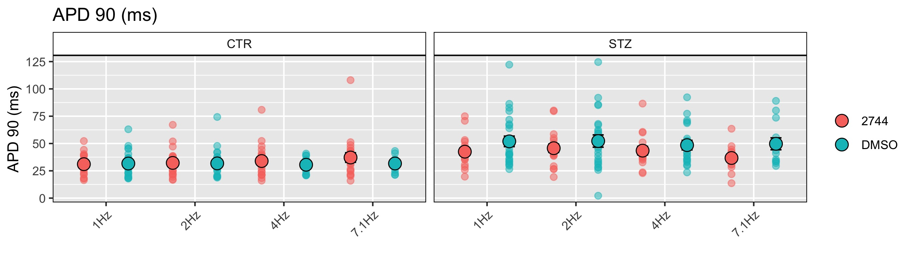

# Action Potential Batch Analyser

This script allows the automated analysis of triggered cardiac action potentials (APs) from adult, neonatal and hiPSC-derived cardiomyocytes recorded with the patch clamp technique.

I hope this open source software tool might ease your PhD- or Postdoc life and avoid you to spend nights analysing cardiac APs instead of enjoying a [nice Belgian beer](https://tripelbier.nl/wp-content/uploads/2017/05/Carolus-versie-3-e1500886644294-1068x801.jpg) 😉🍺. 

⚠️ **Important**: since this software tool is and will remain open source (under GPL v3.0 license), please feel free to fork this repository, to suggest modifications and improvements and to let me know if anything is unclear or does not meet your expectations. 

## Prerequisites

The prerequisite are R and RStudio Desktop. Please download R from [here](https://www.r-project.org/) following the instructions for your specific operating system. RStudio Desktop can be freely downloaded for each platform from [here](https://www.rstudio.com/products/rstudio/download/). This tool is designed to operate with traces generated by Molecular Devices patch clamp hardware/software combinations. It uses Axon Binary Files (.abf) as input files, and it outputs and analyzes parameters useful for cardiac AP characterisation. If you do use instruments from other brands, let me know and we will find a workadound to load them into the tool. 


### Knowledge of the parameters

These paramters are:

| Parameter                         | Abbreviation | Measure unit | Description                                                                                         |
|-----------------------------------|--------------|--------------|-----------------------------------------------------------------------------------------------------|
| AP Durations                      | APD          | ms           | AP durations (APD) at 10% to 90% of the repolarisation phase, from APD_10 to APD_90 in steps of 10% |
| Resting Membrane Potential        | Ediast       | mV           | Resting membrane potential                                                                          |
| AP Amplitude                      | APA          | mV           | The span of the AP from the baseline to the peak                                                    |
| AP Peak                           | Peak         | mV           | The max upstroke peak value reached by the AP                                                       |
| Maximum upstroke velocity         | dV/dt_max    | V/s          | The maximum upstroke velocity of the depolarisation phase of the AP                                 |
| Maximum decay velocity            | -dV/dt_max   | V/s          | The maximum velocity reached in the repolarisation phase of the AP                                  |
| Short Term Variability of the APD | SD1          | ms 		  | Measures the Short Term (beat-to-beat) Variability of the APD_90.                                   |
| Long Term Variability of the APD 	| SD2          | ms 		  | Measures the Long Term Variability (longitudinal drift over time) of the APD_90.                                                  |


### File Format

The pClamp suite is necessary to record the traces and generate the files with a *.abf* (Axon Binary File) extension.

In the old version of this software it was necessary to convert *.abf* to *.atf* to make EP traces recorded in sweeps to be readable by R. This was true until I discovered the great package [*readABF*](https://CRAN.R-project.org/package=readABF), which allows the direct import of ABFs into large data lists. Kudos to Stanislav Syekirin and Florian Pein.


### Folder Structure Preparation (super important!)

Once you have cloned the directories, import in the *data* folder all the ABF files you want to analyze. 

For the way this tool is written, the general folder structure I recommend is the following:

```
Species_Group_Condition1_Condition2_..._Condition`N`
```


It is mandatory to **create one folder for each pacing frequency and/or for each condition**. For example, if you have to analyse APs from Guinea Pig (`Species`) CMs, in control and in the presence of a drug (`Group`) at two different pacing frequencies or drug concentrations (`Condition`), I recommend to create 4 folders with the following structure:

* GP\_CTR\_PacingFrequency_1
* GP\_DRUG\_PacingFrequency_1
* GP\_CTR\_PacingFrequency_2
* GP\_DRUG\_PacingFrequency_2

or:

* iPSC\_Vehicle
* iPSC\_Isoprenaline_1µM
* iPSC\_Isoprenaline_10µM


The tool generates and automatically orders a quite large number of analysis files, so it is strongly recommended to properly divide the *.abf* files in the proper folders **before** running the analysis.

From now on, these folders will be generically termed as `foldername`.

## How it works

The tool identifies, within the time course of an AP file, the APs which have the lowest and most stable diastolic intervals. Among these, the tool generates groups of *N* (this number is customizable) subsequent APs. Among these groups, it will select the one characterised by lowest absolute APD_90 cumulative difference, and it will calculate and average all the parameters from these *N* APs. Default values for *N* are 5 for the calculation of AP parameters and 30 for STV calculations. With the exclusion of SD1 and SD2, each parameter will be calculated and described by a binary system of coordinates.

## How to launch it
### macOS and Linux
* Launch by double-clicking `AP_Batch_Analyzer.sh`. This will open a Terminal window and load the Shiny app interface.


### Windows
* Launch by double-clicking `app.R` in the main directory. This will load the Shiny app in RStudio;
* In the top side of the RStudio window, click `▶️ Run App`.

### Interface
Once the app has launched, you will have access to a simplified interface with three main choices:
1. Select the APDs for which you want quantitative data. APD90 is default and mandatory.
2. Enter the number of APs that you want to be averaged at the steady state. The default is 5.
3. Enter the number of APs that you want to be used for SD1 and SD2 calculations. The default is 30, if available.


After entering all the parameters, click `RUN` to start the analyses.

## Analyses

The tool will automatically create the analysis folders based on input folder names. 

### Analysis Folder Structure
```
.
└─── output
	└─── analyses  
	 	└─── `foldername`
		      └─── APA
			    └─── `filename` APA.csv 
			    └─── ...  
		      └─── APD
			    └─── `filename`.csv
			    └─── ...  
		      └─── dVdt_max
			    └─── `filename` dVdt_max.csv
			    └─── ...  
		      └─── Ediast
			    └─── `filename` Ediast.csv
			    └─── ...  
		      └─── Negative_dVdt_max
			    └─── `filename` Negative dVdt_max.csv
			    └─── ...  
		      └─── Peak
			    └─── `filename` Peak.csv
			    └─── ... 
		      └─── `foldername` Mean Values.csv
```            

### Analysis Files

The tool will generate the following analysis files:

#### `foldername` Mean Values.csv
(e.g. GP\_CTR\_PacingFrequency_1 Mean Values.csv)

This file contains the mean values for all the parameters, indicated above, for each of the analysed file.
Specifically for APDs: according to the number of APD values chosen at the beginning of the analysis, more columns will be added to this table. If APD\_10, APD\_50, APD\_90 are selected at the beginning, the table will add 3 columns.

## Plots

The tool will generate the following plots:

```
.
└─── output
	└─── img  
	      └─── `foldername` 
		    └─── `filename` AP Parameters.jpeg
		    └─── `filename` APD Values.jpeg
		    └─── `filename` BVR_APD90.jpeg
		    └─── `filename` SS Selection.jpeg
```


This plot is made by 4 panels:
1. Top left: the representative APs automatically selected by the tool. The black dots represent the APD90 of each AP.
2. Bottom left: the first derivative of the aforementioned APs, which clearly shows the max. repolarisation velocity (-dV/dt_max).
3. Top right: this panel helps the user to see whether the upstroke phase is clear or whether it has an artifact due to the stimulus pulse.
4. Bottom right: the first derivative of the zoomed-in APs. This helps the user to undestand whether the upstroke velocity (dV/dt_max) is correctly measured. Black dots indicate the dV/dt_Max points that have been used for the analyses.


This plot is very important: it shows the time course of APD90 (top) and Ediast (bottom); coloured in red are the points automatically selected for the subsequent AP analyses, while in green are indicated those selected for the STV analysis. The automatic selection is based on two parameters:

1. The polarisation of E_diast: the tool will select the APs in the most negative quantile (default 80%). which should be as much negative as possible. This filter may not be very useful for adult CMs, bt for stem cell-derived CMs I have noticed that more reliable APD values are obtained when negative Ediasts are used.
2. The variability of the APD90, which should be as minimum as possible for a proper steady state.


This plot may be useful to check whether all the selected AP values are at in a steady state. It may also be useful to get APD values in a glance.


This is the Poincaré plot used to calculate and visualize APD90 dispersion (SD1 and SD2) as previously done in [Altomare et al., Circulation: Arrhythmia & Electrophysiology, 2015](https://doi.org/10.1161/circep.114.002572).


## Summary plots

Once the script has finished, you may want to run the `AP_Output_Analysis.R` file, which analyses all the average traces and plots them in bar graphs. This script will work only when the data have the same number of fields (check the Folder Structure section above) otherwise no comparison would be possible. 

Each parameter is individually outputed and the following plots are generated:

```
.
└─── output
	└─── img  
	      └─── `APA_Averages.jpeg` 
	      └─── `APD_N*_Averages.jpeg` 
	      └─── `dVdt_Averages.jpeg` 
	      └─── `Ediast_Averages.jpeg`
	      └─── `Negative_dVdt_Averages.jpeg`
	      └─── `Peak_Averages.jpeg`  
	      └─── `STV_Averages.jpeg`  		   
```
For a more efficient group comparison, when more than one experimental group is analysed, the images will additionally include the "Combined" version, with groups and conditions compared on the same plot.



I have not introduced statistics in this tool as it is difficult to predict the number of groups the user would like to compare. The automated output analysis provides a complete table with all the mean data and some basic graphical comparisons between groups. 

## Limitations
There are some known limitations so far:
1. This tool can handle only triggered APs. Spontaneous APs recorded in gap free mode are currently not supported, but it is a planned update.
2. In some rare conditions, and particularly when working with CMs that have a low upstroke velocity, stimulation artifacts might be selected by the software as dV/dt_max values, particularly when the square pulse is long (> 3 ms) and the access resistance is quite high (> 30 MΩ).

---

**TL;DR for non-electrophysiologists: this tool will allow you to get reliable and consistent analyses of triggered APs in an automated way, as long as you have recorded APs correctly ;)**

