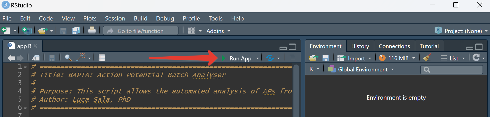
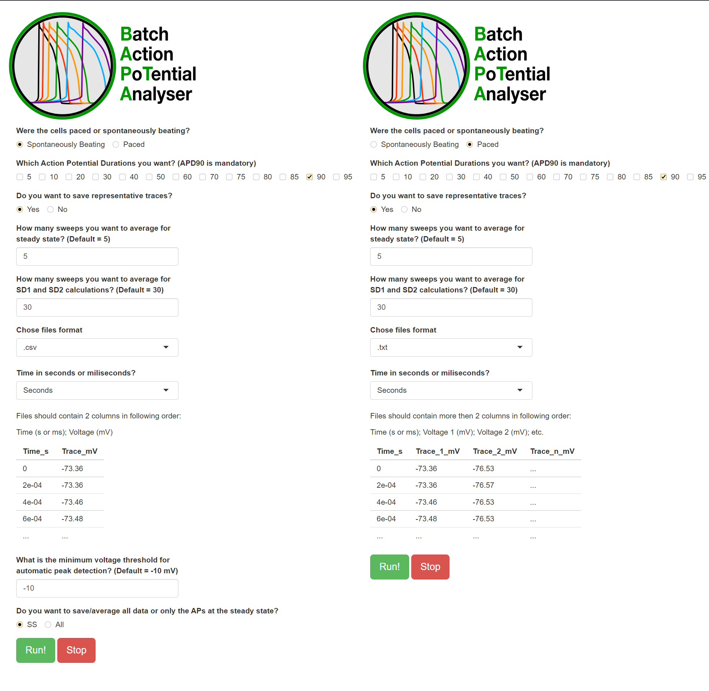

# Batch Action PoTential Analyzer (BAPTA) - User Manual
Luca Sala and Vladislav Leonov

---

BAPTA allows the automated analysis of triggered (Paced) and spontaneous (Gap-Free) cardiac action potentials (APs) from adult, neonatal and hiPSC-derived cardiomyocytes recorded with the patch-clamp technique. We hope this open source software tool might ease your scientific life and avoid you to spend nights analyzing cardiac APs!

**Important:** Current version of BAPTA works natively with Axon Binary Files (**.abf**). Compatibility with other systems is implemented via **.csv** or **.txt** formats. This software tool is and will remain open source - GPL v3.0 license.

### Knowledge of the parameters

BAPTA will extract the parameters listed in the table below. It is important to understand these parameters, so we provide below a brief description:

| Parameter                         | Abbreviation | Measure unit | Description                                                                                          
|-----------------------------------|--------------|--------------|-----------------------------------------------------------------------------------------------------|
| Action Potential (AP) Duration    | APD          | ms           | AP durations (APD) from peak to 10%-90% (step of 10%) of the repolarization phase.                  |
| Maximum Diastolic Potential (**Only for Spontaneous APs**)  | MDP          | mV           | Most negative point in diastole for spontaneously beating CMs                                       |
| Resting Membrane Potential      | Ediast       | mV           | Resting membrane potential for paced CMs                                                                          |
| AP Amplitude                      | APA          | mV           | The span of the AP from the baseline to the peak                                                    |
| AP Peak                           | Peak         | mV           | The max upstroke peak value reached by the AP                                                       |
| Maximum upstroke velocity         | dV/dt_max    | V/s          | The maximum upstroke velocity of the depolarization phase of the AP                                 |
| Maximum decay velocity            | -dV/dt_max   | V/s          | The maximum velocity reached in the repolarization phase of the AP                                  |
| RR Intervals / Cycle length (**Only for spontaneous AP**)      | RR           | ms           | Time between two peaks of consequent APs                                |
| Frequency  (**Only for spontaneous AP**)                       | Freq         | Hz           | Frequency at which AP occur                               |
| Short Term Variability of the APD | SD1          | ms           | Short Term (beat-to-beat) Variability of the APD90 (point of 90% AP repolarization) [1-2].               |
| Long Term Variability of the APD  | SD2          | ms           | Long Term Variability (longitudinal drift over time) of the APD90. [1-2] |

## How to use BAPTA

### Installation

1.  Web browser: If you do not have a web browser please download and install a modern one, [Google Chrome](https://www.google.com/chrome/), [Firefox](https://www.mozilla.org/en-US/firefox/new/), Safari, [Brave](https://brave.com) are all supported;

2.  **R:** Download and install [R](https://cloud.r-project.org/) following the instructions for your specific operating system;

3.  **R-Studio:** Download and install [R-Studio](https://www.rstudio.com/products/rstudio/download/#download) following the instructions for your specific operating system;

4.  **BAPTA:** You can clone the repository via [GIT](https://github.com/l-sala/BAPTA.git) or download the zip archive from this page:

    Press "Code" button -\> download ZIP -\> unzip archive to suitable directory.

### File Formats

BAPTA supports the following file formats:

1.  Axon Binary Files (**.abf**) - Paced and Gap-Free modes;
2.  Comma Separated Values format (**.csv**) or (**.txt**) - Paced and Gap-Free mode;

If you plan to use `.txt` and `.csv`, the data should be formatted as follows:

**Gap-Fee Mode:**

Files should contain 2 columns in following order:

1\. Time (s. or ms.); 2. Voltage (mV)

| **Time_s**  | **Trace_mV** |
|-------------|--------------|
| 0           | -73.36       |
| 2e-04       | -73.39       |
| 2e-04       | -73.46       |
| ...         | ...          |

**Paced:**

Files should contain at least 2 columns in following order, with each column representing a different AP:

1\. Time (s or ms); 2. Voltage 1 (mV); 3. Voltage 2 (mV); ... ; n. Voltage n (mV). 

| **Time_s**     | **Trace_1\_mV** | **Trace_2\_mV** | **Trace_n\_mV** |
|----------------|-----------------|-----------------|-----------------|
| 0              | -73.36          | -76.53          | ...             |
| 2e-04          | -73.39          | -76.57          | ...             |
| 2e-04          | -73.46          | -76.53          | ...             |
| ...            | ...             | ...             | ...             |

### Folder Structure Preparation (super important!)

In the root directory (BAPTA folder), find or create a folder named "***data***". All you recordings must be placed in the ***data*** folder. We have used specific directory naming conventions in order to generate automated [tidy data tables](https://cran.r-project.org/web/packages/tidyr/vignettes/tidy-data.html) for the analyses. Before starting the analysis, it is strongly recommended to properly divide files in the proper folders.

**IMPORTANT:**

Folder namings should follow this template, where the underscore `_` is used in the namigs to separate each condition.

<!-- -->

    Species_Group_Condition1_Condition2_..._Condition`N`

It is mandatory to **create one folder for each pacing frequency and/or for each condition**. For example, if you have to analyse APs from Guinea Pig (`Species`) CMs, in control and in the presence of a drug (`Condition 1`) at two different pacing frequencies or drug concentrations (`Condition 2`), I recommend to create 4 folders with the following structure:

-   GP_CTR_Pacing.Frequency.1
-   GP_DRUG_Pacing.Frequency.1
-   GP_CTR_Pacing.Frequency.2
-   GP_DRUG_Pacing.Frequency.2

Another example:

-   iPSC_Vehicle
-   iPSC_Isoprenaline_1µM
-   iPSC_Isoprenaline_10µM

From now on, these folders will be generically termed as `foldername`.

-  The `data` folder should not be modified while BAPTA is running.

-  Paced and Spontaneous files should be analysed in separate runs. at once. Analyze them separately!

## How to launch it

### macOS and Linux

-   Launch by double-clicking `BAPTA.sh`. This will open a Terminal window and load the Shiny app interface.

### Windows

-   Launch by double-clicking `app.R` in the main directory. This will load the Shiny app in RStudio;
-   In the top side of the RStudio window, click ▶️`Run App`. 

### Interface

Once the app has launched, you will have access to a simplified interface with three main choices:

1.  Select Spontaneously Beating or Paced

2.  Select the APDs for which you want quantitative data. APD90 is selected by default and is mandatory.

3.  Select whether you want to save the representative traces or not.

4.  Enter the number of APs that you want to be averaged at the steady state; the default is 5.

5.  Enter the number of APs that you want to be used for SD1 and SD2 calculations; the default is 30.

6.  Chose the file format of your input files.

7.  **In case of .txt or .csv formats:** Provide information about the time units: seconds or milliseconds. 

8.  **Spontaneous Beating only:** Enter the minimum voltage threshold.

    -10 mV is the default value.

9.  **Spontaneous Beating only:** Enter the the minimum cycle length between consequent AP.
      
    **Important:** This parameter significantly influence speed of the analysis. Default value is 100 ms meaning that spontaneous beating frequency 
    expected to be less than 10 Hz. Better to provide closest value (if you not expect higher than 5Hz use 200 ms).

10.  **Spontaneous Beating only:** Select this in case you want to save results of the analysis for the entire file or just for the APs at the steady state.

After entering all the parameters, click **RUN** to start the analyses.

## Analyses

The tool will automatically create the analysis folders based on input folder names.

### Analysis Folder Structure

    .
    └─── output
        └─── analyses  
            └─── `foldername`
                  └─── APA
                    └─── `filename` APA.csv 
                    └─── ...  
                  └─── APD
                    └─── `filename`.csv
                    └─── ...  
                  └─── dVdt_max
                    └─── `filename` dVdt_max.csv
                    └─── ...  
                  └─── Ediast
                    └─── `filename` Ediast.csv
                    └─── ...  
                  └─── Negative_dVdt_max
                    └─── `filename` Negative dVdt_max.csv
                    └─── ...  
                  └─── Peak
                    └─── `filename` Peak.csv
                    └─── ... 
                  └─── Representative_Traces
                    └─── `filename` Representative_Traces.csv
                    └─── ...  
                  └─── RR
                    └─── `filename` RR.csv #Only for spontaneous AP
                    └─── ...  
                  └─── `foldername` Mean Values.csv
            └─── Combined Mean Values.csv
            └─── Combined Mean Values_wide.csv
                  

### Analysis Files

The tool will generate the following analysis files:

#### `foldername` Mean Values.csv

(e.g. GP_CTR_Pacing.Frequency.1 Mean Values.csv)

This file contains the mean values for all the parameters indicated above, for each of the analysed file. Specifically for APDs: according to the number of APD values chosen at the beginning of the analysis, more columns will be added to this table. If APD_10, APD_50, APD_90 are selected at the beginning, the table will have 3 additional columns.

When the analysis is concluded, the script will create: **Combined Mean Values.csv** and **Combined Mean Values_wide.csv**. These files contain mean values across all traces in the analysis and are already formatted for statistics in free or commercial statistical software tools.

### Steady State identification

The tool identifies, within the time course of an AP file, the APs which have the lowest and most stable diastolic intervals. Among these, the tool generates groups of *N* (this number is customizable) subsequent APs. Among these groups, it will select the one characterised by lowest absolute APD_90 cumulative difference, and it will calculate and average all the parameters from these *N* APs. Default values for *N* are 5 for the calculation of AP parameters and 30 for STV calculations. With the exclusion of SD1 and SD2, each parameter will be calculated and described by a binary system of coordinates.

## Plots

For paced APs, BAPTA will generate the following plots:

    .
    └─── output
        └─── img  
              └─── `foldername` 
                └─── `filename` AP Parameters.jpeg
                └─── `filename` APD Values.jpeg
                └─── `filename` BVR_APD90.jpeg
                └─── `filename` SS Selection.jpeg

This plot is made by 4 panels: 1. Top left: the representative APs automatically selected by the tool. The black dots represent the APD90 of each AP. 2. Bottom left: the first derivative of the aforementioned APs, which clearly shows the max. repolarisation velocity (-dV/dt_max). 3. Top right: this panel helps the user to see whether the upstroke phase is clear or whether it has an artifact due to the stimulus pulse. 4. Bottom right: the first derivative of the zoomed-in APs. This helps the user to undestand whether the upstroke velocity (dV/dt_max) is correctly measured. Black dots indicate the dV/dt_Max points that have been used for the analyses.

This plot is very important: it shows the time course of APD90 (top) and Ediast (bottom); coloured in red are the points automatically selected for the subsequent AP analyses, while in green are indicated those selected for the STV analysis. The automatic selection is based on two parameters:

1.  The polarisation of E_diast: the tool will select the APs in the most negative quantile (default 80%). which should be as much negative as possible. This filter may not be very useful for adult CMs, bt for stem cell-derived CMs I have noticed that more reliable APD values are obtained when negative Ediasts are used.
2.  The variability of the APD90, which should be as minimum as possible for a proper steady state.

This plot may be useful to check whether all the selected AP values are at in a steady state. It may also be useful to get APD values in a glance.

This is the Poincaré plot used to calculate and visualize APD90 dispersion (SD1 and SD2) as previously done in [Altomare et al., Circulation: Arrhythmia & Electrophysiology, 2015](https://doi.org/10.1161/circep.114.002572).

For Spontaneous APs, BAPTA will generate the following plots:

    .
    └─── output
        └─── img  
              └─── `foldername` 
                └─── `filename` AP Overlaid Plot.jpeg
                └─── `filename` APD Values.jpeg
                └─── `filename` BVR_APD90.jpeg
                └─── `filename` Gap Free.jpeg

This plot represents the whole timecourse of the recording and it can be used to visualize the whole recording and whether BAPTA has correctly picked up all the APs.

This represents the overlay of all the APs identified by BAPTA in the gap free run.

## Errors

In case BAPTA identifies a file that can not be analysed, it will create a folder named **errors**. This folder will contain `error.csv`, where you may find detailed description about the inappropriate files. Moreover, to help the user understand the issue without using extenal software, BAPTA will include images of these files.

    .
    └─── output
        └─── error  
              └─── `foldername` 
                └─── `filename` error.jpeg
                └─── ...
             └─── error.csv

## Limitations

1.  We have not introduced statistics in this tool as it is difficult to predict the number of groups the user would like to compare. The automated output analysis provides tidy tables which can be used in free or commercial software tools for statistical analyses.
2.  In some rare conditions, and particularly when working with CMs that have a low upstroke velocity, stimulation artifacts might be selected by the software as dV/dt_max values, particularly when the square pulse is long (\> 3 ms) and the access resistance is quite high (\> 30 MOhms).
3.  BAPTA cannot currently discriminate between normal or diseased action potentials, thus arrhythmic events occurring during phases 1-3 of the cardiac AP (e.g. EADs) are not currently recognised.

## Special thanks

Kudos to Stanislav Syekirin and Florian Pein for [*readABF*](https://CRAN.R-project.org/package=readABF) *package and documentation for it*. Package allows the direct import of ABFs into large data lists and help to solve an issue with extraction of stimulation duration.

## References
1. [Heijman J, Zaza A, Johnson DM, Rudy Y, Peeters RL, Volders PG, Westra RL. Determinants of beat-to-beat variability of repolarization duration in the canine ventricular myocyte: a computational analysis. PLoS Comput Biol. 2013;9(8):e1003202. doi: 10.1371/journal.pcbi.1003202. Epub 2013 Aug 22. PMID: 23990775; PMCID: PMC3749940.](https://www.ncbi.nlm.nih.gov/pmc/articles/PMC3749940/)
2. [Altomare C, Bartolucci C, Sala L, Bernardi J, Mostacciuolo G, Rocchetti M, Severi S, Zaza A. IKr Impact on Repolarization and Its Variability Assessed by Dynamic Clamp. Circ Arrhythm Electrophysiol. 2015 Oct;8(5):1265-75. doi: 10.1161/CIRCEP.114.002572. Epub 2015 Jun 23. PMID: 26105569.](https://pubmed.ncbi.nlm.nih.gov/26105569/)

------------------------------------------------------------------------

**TL;DR for non-electrophysiologists: this tool will allow you to get reliable and consistent analyses of triggered APs in an automated way, as long as you have recorded APs correctly ;)**
